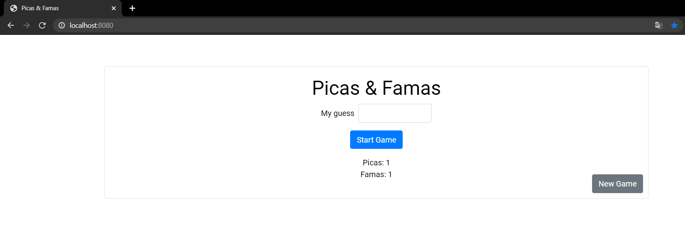

# HOMEWORK 4 ARSW (Picas & Famas Sprint)

Build an app in Spring that implements the famous games of pikes and fame and that is deployed in Heroku. Deliver your updated github repository and link to the app running on Heroku.

# START

Copie el proyecto via git clone en cualquier diretorio para empezar a trabajar:
```
git clone https://github.com/Juaco9502/Spring.git
```

## INSTALL

1. Run in terminal:

```
$$ mvn clean package
```

2.(Optional):
If you want to view the documentation of the application, execute the following command and check the following path: root / target:

```
mvn javadoc:javadoc
```

3. (Run):
The following command must be used in the project root folder:
  
```
mvnw spring-boot:run
```

### Execute



## HEROKU
[Link](https://springame.herokuapp.com/)
https://springame.herokuapp.com/

## PRE-REQUISITES

* Java jdk > 7
* Maven (Apache Maven)
* Git
  

## BUILT

* [Maven](https://maven.apache.org/) - Dependency Management
* [JAVA JDK 8](http://www.oracle.com/technetwork/java/javase/overview/index.html) - Building
* [JUnit 3.8.1](https://mvnrepository.com/artifact/junit/junit/3.8.1) - Test


## AUTHOR

* **JUAN CAMILO ORTIZ MEDINA** - [Juaco9502](https://github.com/juaco9502)


## LICENSE

This project is licensed under the GNU General Public License - [LICENSE](LICENSE) 